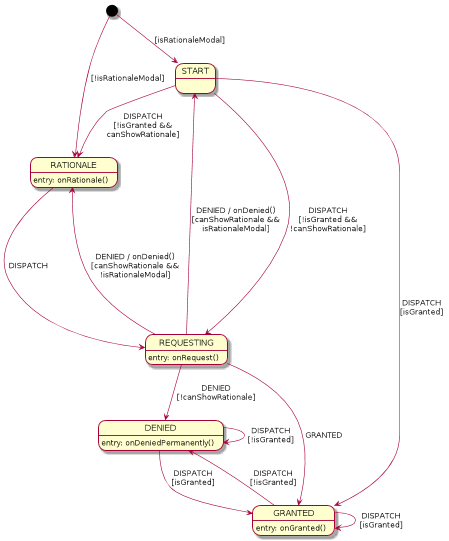

# EzPermission

Handling dynamic permissions on Android is a major PITA, mainly due to the braindead API
design.

This library is yet another helper that makes permission handling easier.

It's based on state machine that handles the user flow.
Pass a code that requires a permission as a callback and invoke it via
`EzPermission.call()` helper. The helper will handle permission flow and call
intended code when permission is available.

# Features

1. single-file implementation, if you want to pull it inside your project
2. based on state machine, so fixing corner cases should be very easy
3. modal rationale (using dialog)
4. modeless rationale (being integrated into screen itself)
5. focused on permission handling logic - doesn't contain any UI code
6. handles permissions revoked at runtime via settings menu
7. handles permissions granted at runtime via settings menu

# Limitations

1. Handles only 1 permission at a time
2. focused on permission handling logic - doesn't contain any UI code

# Integration

## Dependencies

Add my private bintray repository in your root `build.gradle`:

    allprojects {
        repositories {
            ...
            maven {
                url "https://dl.bintray.com/ezaquarii/android"
            }
        }
    }
    
In module `build.gradle`, add a dependency:
    
    compile ('com.ezaquarii:ezpermission:1.0.1') {
        exclude group: 'com.android.support'
    }

## Modeless

Modeless flow is useful in situations, when we can't construct the screen UI without
proper permission. A canonical example of such case is a camera application, where
camera preview occupies full screen.

    class MainActivity : AppCompatActivity() {

        companion object {
            @JvmField val REQUEST_CAMERA_PERMISSION = 1000;
        }

        private val mInitCamera = EzPermission(this, REQUEST_CAMERA_PERMISSION, false,
                Manifest.permission.CAMERA,
                { onCameraGranted() },
                { onCameraRationale() },
                { onCameraDenied() },
                { onCameraDeniedPermanently() }
        );
        
        override fun onStart() {
            super.onStart()
            mInitCamera.call();
        }
        
        ...
        
    }

## Modal

Modal flow is probably the most popular one. Permission rationale is shown as a dialog (or similar UI widget),
that breaks the user flow. Once user accepts the rationale, we launch permission query again.

With `EzPermission` this is... well... easy.

    class MainActivity : AppCompatActivity() {

        companion object {
            @JvmField val REQUEST_AUDIO_PERMISSION = 2000;
        }
    
        private val mRecordAudio = EzPermission(this, REQUEST_AUDIO_PERMISSION, true,
                Manifest.permission.RECORD_AUDIO,
                { onAudioGranted() },
                { onAudioRationale() },
                { onAudioPermissionDenied() },
                { onAudioPermissionDeniedPermanently() })
                
        // on click handler, attached to some "record" button        
        fun onClickedRecordAudio(v: View) {
            mRecordAudio.call()
        }
        
        // called when permission to use microphone is obtained
        private fun onAudioGranted() {
            toast("Recording audio")
        }
        
        ...
    
    }
            
## What are those callbacks?

Callbacks provided to `EzPermission` are being invoked by the state machine at appropriate
moment. You should consult provided sample to see how to use those callbacks to implement UI
changes (reveal rationale, launch alerts, etc).

# Credits

1. [PlantUml](http://plantuml.com/) folks, for excelent, pragmatic UML tool. Your stuff rocks
2. [The Apache Software Foundation](https://www.apache.org/) for Apache 2.0 Licence
3. [CryoChamber](https://www.youtube.com/user/cryochamberlabel) for background noise

# Licence

    Copyright (C) EzPermission by Krzysztof Narkiewicz (hello@ezaquarii.com)
    
    Licensed under the Apache License, Version 2.0 (the "License");
    you may not use this file except in compliance with the License.
    You may obtain a copy of the License at
    
    http://www.apache.org/licenses/LICENSE-2.0
    
    Unless required by applicable law or agreed to in writing, software
    distributed under the License is distributed on an "AS IS" BASIS,
    WITHOUT WARRANTIES OR CONDITIONS OF ANY KIND, either express or implied.
    See the License for the specific language governing permissions and
    limitations under the License.